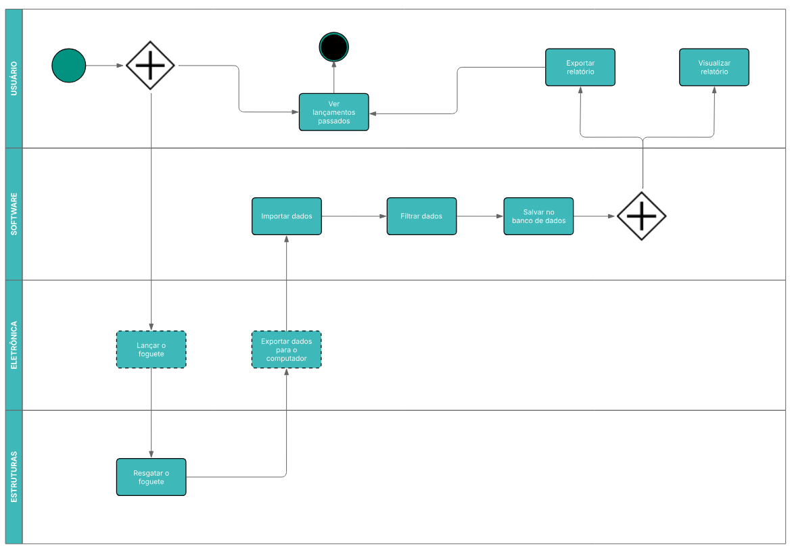

# Requisitos

Nesta seção, apresentamos os principais requisitos do sistema, detalhados por meio de diversas técnicas e ferramentas utilizadas durante o processo de levantamento, análise e organização das necessidades do projeto. O objetivo é garantir uma compreensão clara e estruturada do que o sistema deve (e não deve) fazer, bem como fornecer uma base para o desenvolvimento e validação do produto.

## É, Não É, Faz, Não Faz

O objetivo desta técnica é definir claramente os limites do escopo do sistema. Abaixo estão descritas as funcionalidades e características **que fazem parte do produto** e aquelas **que estão fora do escopo**, evitando ambiguidades e desalinhamentos entre os envolvidos no projeto.

### O Produto É

- Analisador de dados
- Gerador de gráficos
- Sistema de importação/exportação de dados de voo

### O Produto NÃO É

- Sistema de controle em tempo real         
- App mobile                                 
- Sistema de controle de lançamento          
- Simulação gráfica 3D ou renderização do voo 
- Sistema de controle do foguete  

### Faz

- Relatórios
- Exporta dados
- Mostra lançamentos antigos

### Não Faz

- Simula lançamentos
- Analisa os dados
- Propõe correçoes
- Pega dados em tempo real
- Envia dados para o foguete

## Matriz CSD

Resume as principais certezas, suposições e dúvidas relacionadas ao sistema de software do projeto de análise de voo.

### Certezas

- O sistema recebe arquivos JSON de sensores do foguete.
- O sistema gera gráficos com base nos dados.
- O sistema será desenvolvido em Python.
- Será possível exportar os dados tratados em arquivos CSV.
- O sistema funcionará de forma offline.

### Suposições

- O sistema aplicará filtros a dados brutos (ex: média móvel).
- Dados absurdos (ex: altitude negativa) devem ser descartados.
- As unidades de medida seguirão o Sistema Internacional (SI).
- Será possível importar arquivos antigos para comparar dados entre voos.

### Dúvidas

- Qual será a formatação exata dos dados recebidos?
- Por qual meio ocorrerá a transferência dos dados (USB, SD, etc.)?
- O sistema terá uma interface web para facilitar a visualização dos gráficos?

## 5W2H

A técnica 5W2H foi aplicada para detalhar ações importantes no desenvolvimento do sistema de análise de dados dos lançamentos de foguete. Abaixo estão listadas algumas funcionalidades essenciais e seus respectivos planejamentos.

| What                            | Why                                                                 | Where                        | When                               | Who                          | How                    | How Much   |
|---------------------------------|----------------------------------------------------------------------|------------------------------|-------------------------------------|------------------------------|------------------------|------------|
| Importar dados do lançamento    | Para permitir que o sistema leia e processe informações dos sensores | Via upload de arquivos de microSD | Início de cada análise            | Grupo de software do grupo 2 | Python (pandas)                      | Sem custo  |
| Testar o sistema                | Garantir que os dados sejam interpretados corretamente               | Ambiente de testes           | Durante o desenvolvimento do projeto | Grupo de software do grupo 2 | Testes unitários e de integração (pytest)                      | Sem custo  |
| Gerar gráficos de dados         | Para facilitar visualização dos dados                                | Interface gráfica do sistema | Após a importação e processamento dos dados | Grupo de software do grupo 2 | Python (matplotlib)                      | Sem custo  |
| Detectar e descartar dados corrompidos | Para garantir integridade da visualização e evitar erros de interpretação | Backend do sistema           | Após a importação dos dados         | Grupo de software do grupo 2 | Python (matplotlib)                      | Sem custo  |

##  Histórias de usuário

| ID   | REQUISITO | DESCRIÇÃO |
|------|-----------|-----------|
| US01 | RQ01 | Eu, como usuário, desejo importar dados de voo em formato JSON a partir de um dispositivo removível, para que eu possa gerar gráficos. |
| US02 | RQ02 | Eu, como usuário, desejo visualizar um gráfico de linha com a velocidade vertical ao longo do tempo, para analisar o desempenho do voo. |
| US03 | RQ03 | Eu, como usuário, desejo visualizar um gráfico de linha com a aceleração vertical ao longo do tempo, para entender as variações de força no voo. |
| US04 | RQ04 | Eu, como usuário, desejo visualizar um gráfico de dispersão com a trajetória horizontal no plano X e Y, para acompanhar o caminho do foguete. |
| US05 | RQ05 | Eu, como usuário, desejo visualizar um gráfico de linha com a altitude ao longo do tempo, para verificar a elevação durante o voo. |
| US06 | RQ06 | Eu, como usuário, desejo visualizar os valores máximos e mínimos de aceleração, velocidade e ângulo, para obter indicadores importantes do voo. |
| US07 | RQ07 | Eu, como usuário, desejo visualizar o tempo total de execução e os intervalos de amostragem, para avaliar a precisão dos dados. |
| US08 | RQ08 | Eu, como usuário, desejo exportar os dados do voo em arquivos CSV, para armazená-los em um banco de dados. |
| US09 | RQ09 | Eu, como usuário, desejo importar arquivos CSV anteriores, para realizar comparações e simulações. |
| US10 | RQ10 | Eu, como usuário, desejo aplicar filtros de média móvel nos dados dos sensores, para suavizar ruídos e facilitar a análise. |

## Backlog

| HISTÓRIA DE USUÁRIO | FEATURES                                        | ÉPICOS                                           |
|---------------------|--------------------------------------------------|--------------------------------------------------|
| US01                | Feature 1 - Importar dados do voo em JSON        |                                                  |
| US08                | Feature 2 - Exportar dados em CSV                | Épico 1 - Importação e exportação de dados       |
| US09                | Feature 3 - Importar dados em CSV                |                                                  |
|                     |                                                  |                                                  | 
| US02                | Feature 4 - Exibir gráfico de velocidade         |                                                  |
| US03                | Feature 5 - Exibir gráfico de aceleração         | Épico 2 - Visualização gráfica dos dados         |
| US04                | Feature 6 - Exibir gráfico da trajetória         |                                                  |
| US05                | Feature 7 - Exibir gráfico de altitude           |                                                  |
|                     |                                                  |                                                  |
| US06                | Feature 8 - Exibir valores extremos              |                                                  |
| US07                | Feature 9 - Exibir dados de execução             | Épico 3 - Análise e tratamento dos dados         |
| US10                | Feature 10 - Aplicar filtro de média móvel       |                                                  |

## MoSCoW

A tabela abaixo apresenta os requisitos funcionais priorizados com base na técnica MoSCoW:

| ID    | Descrição                                                                 | Prioridade   |
|-------|---------------------------------------------------------------------------|--------------|
| RQ01  | Importar dados de voo em JSON de dispositivo externo                     | Must have    |
| RQ02  | Exibir gráfico de velocidade vertical vs. tempo                          | Must have    |
| RQ03  | Exibir gráfico de aceleração vertical vs. tempo                          | Must have    |
| RQ04  | Exibir gráfico de dispersão da trajetória no plano X e Y                 | Must have    |
| RQ05  | Exibir gráfico de altitude vs. tempo                                     | Must have    |
| RQ06  | Exibir valores máximos e mínimos de aceleração, velocidade e ângulo     | Should have  |
| RQ07  | Exibir tempo de execução e intervalos de amostragem                     | Should have  |
| RQ08  | Exportar dados do voo em CSV                                             | Must have    |
| RQ09  | Importar arquivos CSV para comparação e simulação                        | Must have    |
| RQ10  | Aplicar filtro de média móvel nos dados dos sensores                     | Should have  |

### Legenda

| Prioridade   | Descrição                                                                 |
|--------------|---------------------------------------------------------------------------|
| Must have    | Funcionalidades essenciais e obrigatórias                                 |
| Should have  | Importantes, mas não essenciais; podem ser entregues após as principais   |
| Could have   | Desejáveis, mas não prioritárias; não fazem parte do escopo inicial       |
| Won't have   | Não serão incluídas no momento                                            |

## Diagramas de Caso de Uso

Cada caso de uso representa uma ação importante realizada pelo sistema, como importar dados ou gerar gráficos. Esse tipo de diagrama ajuda na compreensão dos requisitos funcionais e na definição dos limites da atuação de cada usuário.

[IMAGEM DIAGRAMA CASO DE USO]

## Diagramas BPMN

No contexto deste projeto, o BPMN representa o fluxo desde o recebimento dos dados do foguete até a análise e visualização dos resultados.

## Histórico de Versão

| Versão | Data     | Descrição            | Autor(es)                                     | 
| ------ | -------- | -------------------- | --------------------------------------------- | 
| `1.0`  | 18/05/25 | Primeira versão da documentação de requisitos. Inclui 5W2H, CSD, É/Não É, BPMN, diagrama de caso de uso, priorização MoSCoW e backlog inicial com base nos requisitos funcionais. | Millena e Hugo |
